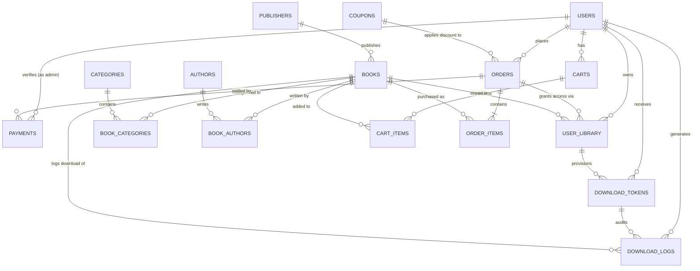

# Database Architecture & Relational Schema Design

## 1. Overview
This document specifies the complete relational schema design for the E-Book Store System built on **PostgreSQL (Neon Database)**. It adheres to strict normalization standards (3NF/BCNF), enforces referential integrity with cascading rules, and captures comprehensive audit trails.

---

## 2. Entity-Relationship Diagram (ERD)



---

## 3. Relational Schema & Data Dictionary

### 3.1 `users`
Represents both customers and administrators.

| Column | Type | Constraints | Description |
|---|---|---|---|
| `id` | `BIGINT GENERATED ALWAYS AS IDENTITY` | `PRIMARY KEY` | Internal surrogate ID |
| `email` | `VARCHAR(255)` | `NOT NULL UNIQUE` | User login email |
| `password_hash` | `VARCHAR(255)` | `NOT NULL` | Argon2 / bcrypt hash |
| `full_name` | `VARCHAR(150)` | `NOT NULL` | Customer or Admin name |
| `phone` | `VARCHAR(50)` | `NULL` | Contact phone number |
| `role` | `VARCHAR(20)` | `NOT NULL CHECK (role IN ('customer', 'admin'))` | User permission role |
| `created_at` | `TIMESTAMPTZ` | `NOT NULL DEFAULT CURRENT_TIMESTAMP` | Registration date |
| `updated_at` | `TIMESTAMPTZ` | `NOT NULL DEFAULT CURRENT_TIMESTAMP` | Last profile update |

---

### 3.2 `publishers` & `authors`
Catalog master tables.

```sql
-- publishers
id            BIGINT GENERATED ALWAYS AS IDENTITY PRIMARY KEY,
name          VARCHAR(150) NOT NULL UNIQUE,
contact_email VARCHAR(255),
created_at    TIMESTAMPTZ NOT NULL DEFAULT CURRENT_TIMESTAMP

-- authors
id            BIGINT GENERATED ALWAYS AS IDENTITY PRIMARY KEY,
name          VARCHAR(150) NOT NULL,
bio           TEXT,
created_at    TIMESTAMPTZ NOT NULL DEFAULT CURRENT_TIMESTAMP
```

---

### 3.3 `categories` & `book_categories` (Many-to-Many)
Resolves multi-category taxonomy in 3NF.

```sql
-- categories
id            BIGINT GENERATED ALWAYS AS IDENTITY PRIMARY KEY,
name          VARCHAR(100) NOT NULL UNIQUE,
slug          VARCHAR(100) NOT NULL UNIQUE,
description   TEXT,
created_at    TIMESTAMPTZ NOT NULL DEFAULT CURRENT_TIMESTAMP

-- book_categories (Junction Table)
book_id       BIGINT NOT NULL REFERENCES books(id) ON DELETE CASCADE,
category_id   BIGINT NOT NULL REFERENCES categories(id) ON DELETE CASCADE,
PRIMARY KEY (book_id, category_id)
```

---

### 3.4 `books` & `book_authors`
E-Book product catalog.

```sql
-- books
id               BIGINT GENERATED ALWAYS AS IDENTITY PRIMARY KEY,
title            VARCHAR(255) NOT NULL,
subtitle         VARCHAR(255),
isbn             VARCHAR(20) UNIQUE,
publisher_id     BIGINT REFERENCES publishers(id) ON DELETE SET NULL,
price            NUMERIC(10, 2) NOT NULL CHECK (price >= 0),
discount_price   NUMERIC(10, 2) CHECK (discount_price IS NULL OR discount_price >= 0),
cover_image_url  TEXT NOT NULL,
sample_file_url  TEXT,
file_url         TEXT NOT NULL,
file_format      VARCHAR(10) NOT NULL DEFAULT 'PDF' CHECK (file_format IN ('PDF', 'EPUB')),
file_size_bytes  BIGINT NOT NULL DEFAULT 0,
page_count       INT CHECK (page_count > 0),
publication_date DATE,
is_active        BOOLEAN NOT NULL DEFAULT TRUE,
created_at       TIMESTAMPTZ NOT NULL DEFAULT CURRENT_TIMESTAMP,
updated_at       TIMESTAMPTZ NOT NULL DEFAULT CURRENT_TIMESTAMP

-- book_authors (Junction Table)
book_id          BIGINT NOT NULL REFERENCES books(id) ON DELETE CASCADE,
author_id        BIGINT NOT NULL REFERENCES authors(id) ON DELETE CASCADE,
author_role      VARCHAR(50) NOT NULL DEFAULT 'main_author',
PRIMARY KEY (book_id, author_id)
```

---

### 3.5 `carts` & `cart_items`
Pre-checkout shopping cart.

```sql
-- carts
id          BIGINT GENERATED ALWAYS AS IDENTITY PRIMARY KEY,
user_id     BIGINT NOT NULL UNIQUE REFERENCES users(id) ON DELETE CASCADE,
updated_at  TIMESTAMPTZ NOT NULL DEFAULT CURRENT_TIMESTAMP

-- cart_items
id          BIGINT GENERATED ALWAYS AS IDENTITY PRIMARY KEY,
cart_id     BIGINT NOT NULL REFERENCES carts(id) ON DELETE CASCADE,
book_id     BIGINT NOT NULL REFERENCES books(id) ON DELETE CASCADE,
added_at    TIMESTAMPTZ NOT NULL DEFAULT CURRENT_TIMESTAMP,
UNIQUE (cart_id, book_id)
```

---

### 3.6 `coupons`
Discount promotion vouchers.

```sql
id              BIGINT GENERATED ALWAYS AS IDENTITY PRIMARY KEY,
code            VARCHAR(50) NOT NULL UNIQUE,
discount_type   VARCHAR(20) NOT NULL CHECK (discount_type IN ('FIXED', 'PERCENTAGE')),
discount_value  NUMERIC(10, 2) NOT NULL CHECK (discount_value > 0),
min_spend       NUMERIC(10, 2) NOT NULL DEFAULT 0.00,
valid_from      TIMESTAMPTZ NOT NULL,
valid_to        TIMESTAMPTZ NOT NULL,
usage_limit     INT NOT NULL DEFAULT 100,
times_used      INT NOT NULL DEFAULT 0,
is_active       BOOLEAN NOT NULL DEFAULT TRUE,
created_at      TIMESTAMPTZ NOT NULL DEFAULT CURRENT_TIMESTAMP
```

---

### 3.7 `orders` & `order_items`
Transaction core with price snapshotting.

```sql
-- orders
id               BIGINT GENERATED ALWAYS AS IDENTITY PRIMARY KEY,
order_number     VARCHAR(64) NOT NULL UNIQUE, -- UUID v4
user_id          BIGINT NOT NULL REFERENCES users(id) ON DELETE RESTRICT,
subtotal_amount  NUMERIC(10, 2) NOT NULL CHECK (subtotal_amount >= 0),
discount_amount  NUMERIC(10, 2) NOT NULL DEFAULT 0.00 CHECK (discount_amount >= 0),
net_amount       NUMERIC(10, 2) NOT NULL CHECK (net_amount >= 0),
coupon_id        BIGINT REFERENCES coupons(id) ON DELETE SET NULL,
order_status     VARCHAR(30) NOT NULL DEFAULT 'PENDING' 
                 CHECK (order_status IN ('PENDING', 'PAYMENT_SUBMITTED', 'PAID', 'REJECTED', 'CANCELLED')),
created_at       TIMESTAMPTZ NOT NULL DEFAULT CURRENT_TIMESTAMP,
updated_at       TIMESTAMPTZ NOT NULL DEFAULT CURRENT_TIMESTAMP

-- order_items (Frozen Price Snapshot)
id               BIGINT GENERATED ALWAYS AS IDENTITY PRIMARY KEY,
order_id         BIGINT NOT NULL REFERENCES orders(id) ON DELETE CASCADE,
book_id          BIGINT NOT NULL REFERENCES books(id) ON DELETE RESTRICT,
unit_price       NUMERIC(10, 2) NOT NULL CHECK (unit_price >= 0),
created_at       TIMESTAMPTZ NOT NULL DEFAULT CURRENT_TIMESTAMP,
UNIQUE (order_id, book_id)
```

---

### 3.8 `payments`
Transfer slip submission and audit logs.

```sql
id                  BIGINT GENERATED ALWAYS AS IDENTITY PRIMARY KEY,
order_id            BIGINT NOT NULL REFERENCES orders(id) ON DELETE CASCADE,
payment_method      VARCHAR(50) NOT NULL DEFAULT 'PROMPTPAY',
amount_paid         NUMERIC(10, 2) NOT NULL CHECK (amount_paid >= 0),
slip_image_url      TEXT NOT NULL,
transferred_at      TIMESTAMPTZ NOT NULL,
status              VARCHAR(30) NOT NULL DEFAULT 'PENDING_REVIEW'
                    CHECK (status IN ('PENDING_REVIEW', 'APPROVED', 'REJECTED')),
verified_by_user_id BIGINT REFERENCES users(id) ON DELETE SET NULL,
verified_at         TIMESTAMPTZ,
rejection_reason    TEXT,
created_at          TIMESTAMPTZ NOT NULL DEFAULT CURRENT_TIMESTAMP
```

---

### 3.9 `user_library`, `download_tokens` & `download_logs`
Digital asset ownership, quota protection, and audit logging.

```sql
-- user_library (Permanent Entitlement)
id          BIGINT GENERATED ALWAYS AS IDENTITY PRIMARY KEY,
user_id     BIGINT NOT NULL REFERENCES users(id) ON DELETE CASCADE,
book_id     BIGINT NOT NULL REFERENCES books(id) ON DELETE RESTRICT,
order_id    BIGINT NOT NULL REFERENCES orders(id) ON DELETE RESTRICT,
granted_at  TIMESTAMPTZ NOT NULL DEFAULT CURRENT_TIMESTAMP,
UNIQUE (user_id, book_id)

-- download_tokens (Secure Access Quotas)
id             BIGINT GENERATED ALWAYS AS IDENTITY PRIMARY KEY,
token          VARCHAR(64) NOT NULL UNIQUE, -- UUID v4
user_id        BIGINT NOT NULL REFERENCES users(id) ON DELETE CASCADE,
book_id        BIGINT NOT NULL REFERENCES books(id) ON DELETE CASCADE,
expires_at     TIMESTAMPTZ NOT NULL,
max_downloads  INT NOT NULL DEFAULT 5,
download_count INT NOT NULL DEFAULT 0,
is_revoked     BOOLEAN NOT NULL DEFAULT FALSE,
created_at     TIMESTAMPTZ NOT NULL DEFAULT CURRENT_TIMESTAMP

-- download_logs (Audit Trail)
id                 BIGINT GENERATED ALWAYS AS IDENTITY PRIMARY KEY,
download_token_id  BIGINT REFERENCES download_tokens(id) ON DELETE SET NULL,
user_id            BIGINT NOT NULL REFERENCES users(id) ON DELETE CASCADE,
book_id            BIGINT NOT NULL REFERENCES books(id) ON DELETE CASCADE,
ip_address         VARCHAR(45),
user_agent         TEXT,
downloaded_at      TIMESTAMPTZ NOT NULL DEFAULT CURRENT_TIMESTAMP
```

---

## 4. Normalization Proof (1NF - 3NF)

### First Normal Form (1NF)
- All table attributes are atomic (no repeating groups, no comma-separated multi-values).
- Each record has a distinct primary key (`id` or composite primary key like `book_categories(book_id, category_id)`).

### Second Normal Form (2NF)
- The schema is in 1NF.
- Every non-prime attribute is fully functionally dependent on the entire primary key.
- In composite key tables (`book_categories`, `book_authors`), no partial dependencies exist.
- In `order_items`, `unit_price` depends on the specific order item snapshot, not just the book alone (since historical prices fluctuate).

### Third Normal Form (3NF / BCNF)
- The schema is in 2NF.
- There are no transitive dependencies: non-key attributes depend only on the primary key.
- Author names and publisher contacts are extracted to `authors` and `publishers` rather than stored in `books`, eliminating update anomalies.
- Customer details (name, email) are kept in `users`, with `orders` referencing `user_id`.
- Payment slip verification attributes depend on `payments.id`, keeping `orders` clean and focused on order progression.
